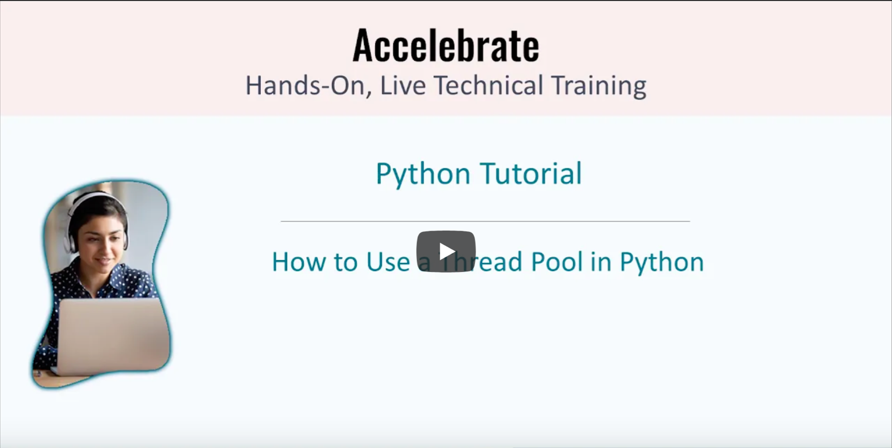

# Accelebrate Video Shorts by T4D.IO

### Improve Python IO Performance with a Thread Pool

[](https://youtu.be/NjWNxsr58tA)

This demonstration represents some of the content covered in the following React courses taught by [Accelebrate](https://www.accelebrate.com/):

- [Advanced Python](https://www.accelebrate.com/training/python-advanced)

Contact [Accelebrate](https://www.accelebrate.com/contact) today for all of your software development training needs. 

### Project Setup

> All instructions and code in this repository are licensed under the MIT license. Read the license text in the file `license.txt` to learn more.

The provided files are the start and finish files for the video. If you desire to code along with the instructor, [Eric Greene](http://www.t4d.io), clone this repository, open the `start` folder in your code editor and get started with the [YouTube Video](#). If you prefer to review only the completed files then browse the `finish` folder. 

**Note:** Before watching the video and coding along you will need to setup your local environment. Within the instructions the word `terminal` refers to the Windows Command Prompt program on Windows and the Terminal program on macOS

**Step 1.** First, you will need to ensure you have Python 3.9.5 installed. Other versions of Python may work, but if you have any problems then please revert to version 3.9.5 as this is version used in the video. To verify if Python is installed on your system open a terminal window, and run the follow the command:

```
python -V
```

> On some systems like macOS, you may need to run `python3` instead of `python`. This is because some systems have both Python 2 and 3 installed. So to run Python 3, the command `python3` must be used.

If your system returns back a version number other than 3.95 or cannot find Python then you will need to install Python 3.9.5. To install using the system installer, please browse to the appropriate link below. The system installer only supports one version being installed on a system at a time.

To download Python for:

- 64-bit Windows: [python-3.9.5-amd64.exe](https://www.python.org/ftp/python/3.9.5/python-3.9.5-amd64.exe)
- macOS: [python-3.9.5-macosx10.9.pkg](https://www.python.org/ftp/python/3.9.5/python-3.9.5-macosx10.9.pkg)
- For all other platforms, look for the appropriate download here: [other platforms](https://www.python.org/downloads/release/python-395/)

Once you download the Node.js installer, run the installer and complete the installation process. We recommend adding Python to the PATH.

Repeat the `python -V` command from a new terminal window to confirm Node.js was installed successfully.

**Step 2.** Clone or download this code respository. To clone this repository, open a terminal window and run the following command:

```
git clone https://github.com/t4d-accelebrate-video-shorts/python-threadpool.git
```

> If `git` cannot be found on your system then please visit the Git website to install it: [https://git-scm.com](https://git-scm.com) 

If you prefer to not use Git then the repository can be downloaded by clicking the following link on the code repository's GitHub page:


Extract the downloaded archive file in the folder of your choice.

**Step 3.** Open the `start` folder in the editor of your choice. We recommended [Visual Studio Code](http://code.visualstudio.com/). It works on Windows, macOS and Linux. It is open source and free. However, any editor can be used. It is recommended to use an editor with a built-in file tree and a built-in terminal window. Also, it is recommended to install Microsoft's Python Extension for Visual Studio Code. The project contains configuration files that will give you nice code linting, code completion, and code re-formatting.

**Step 4.** Create a virtual environment. From a terminal window within the `start` folder run the following command:

```
python -m venv venv
```

**Step 5.** Active the virtual environment. From the same terminal window, within the `start` folder, run the command appropriate for your operating system:

For Windows (PowerShell):

```
venv\Scripts\Activate.ps1
```

For macOS & Linux (Bash or Zsh):

```
source venv/bin/activate
```

For other operating systems or terminal shells, please visit this [web page](https://packaging.python.org/guides/installing-using-pip-and-virtual-environments/#creating-a-virtual-environment) for more information.

**Step 5.** Install the PIP packages for the project. From a terminal window within the `start` folder run the following command:

```
python -m pip install --upgrade pip
python -m pip install -r requirements.txt
```

**Step 6.** Start watching the [YouTube Video](https://youtu.be/NjWNxsr58tA) and code along to learn more about how to improve Python UI performance with a Thread Pool.


